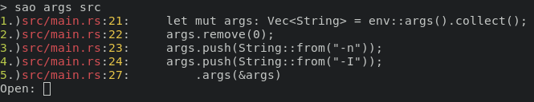

Search And Open
===============

SearchAndOpen(SAO) is a thin wrapper around [ripgrep](https://github.com/BurntSushi/ripgrep). It simly parses the
results from ripgrep and provides an option to open any of the files
containing search hits. By default, SAO opens the file with nvim.

## Usage

Just like ripgrep.

Example output:



## Installation

Install ripgrep. SAO assumes it to be in `/usr/bin/rgrep`.

Build SAO with
```
cargo build --release
```
and copy target binary to `/usr/bin`.
